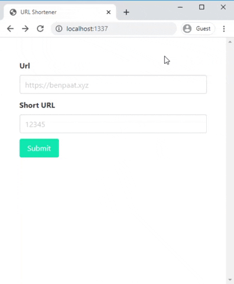

# URL SHORTENER

Creates a short url from a url



## Usage

```
$ # Install all packages
$ yarn
$ # Create .env file
$ cp .env.template .env
$ # Add mongo url
$ # run server
$ yarn develop
```

## Docker Deployment

```
$ docker build -t url-shortener .
$ docker run \
  -e MONGO_URL=<MONGO_URL> \
  -e HOST=0.0.0.0 \
  -e PORT=8013 \
  --name url-shorener \
  -p 8013:8013 \
  url-shortener
```
